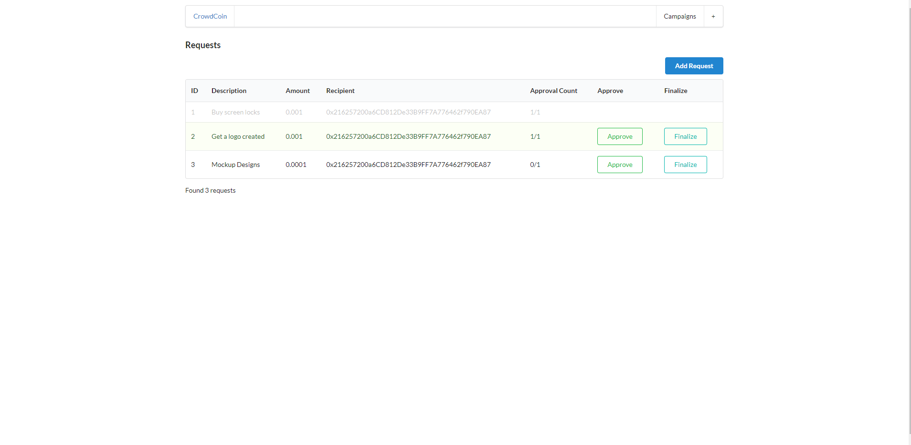

# Kickstarter

## Description

This is a web3 platform that is a mockup of how kickstarter would function on a decentralized platform. This was made as a means of practice and understanding the web3 library on how it worked, as well as blockchain concepts on how it worked. Currently not a working platform for public use, this was intended only for educational purposes only.

## Technologies

-   web3.js
-   Next.js
-   Semantic-ui-react
-   Solidity
-   ganache-cli
-   truffle/hdwallet
-   react
-   infura

## Deployment

There is no working deployment for this project. If you want to see this platform live, you must download it locally and run it on your machine.

## Installation

1. Clone the repository down onto your local machine
2. Install all dependencies by running `npm install` in the CLI
3. Create environment variables in a .env.local file
    - The variables needed will be a NEXT_PUBLIC_API_KEY variable for the [infura API](https://docs.infura.io/infura/getting-started)
    - A NEXT_PUBLIC_CONTRACT_ADDRESS variable will also be needed. This can either be the one I have currently deployed at 0x448aaB9ca7091fE0AA721a3328166DC2aB529F73 on the Rinkeby Test Network, or you can deploy your own contract instance using the deploy scripts found in the Ethereum directory
4. Run `npm run dev` command in your CLI

## Mock-up

### Homepage

### Campaign Page

### New Campaign Form

### Request Page

### New Request Form

